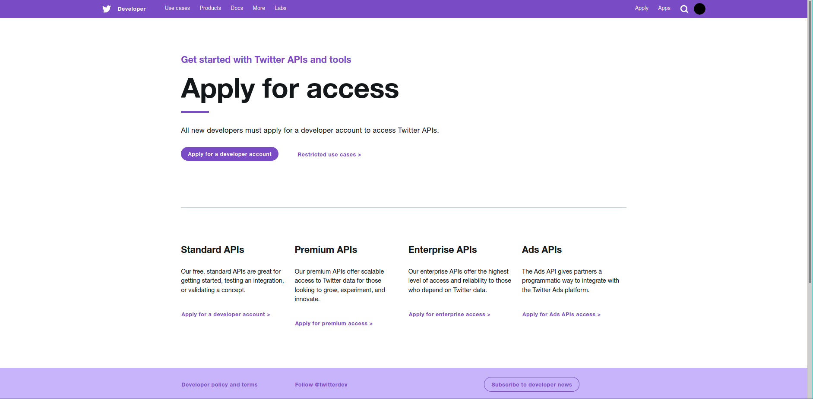
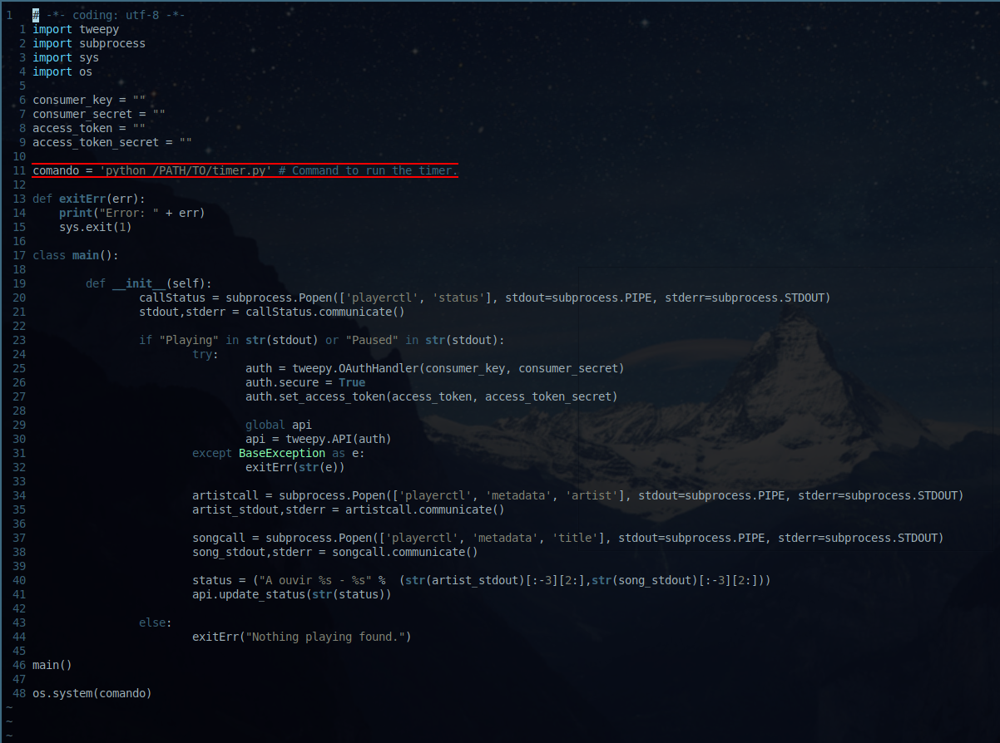
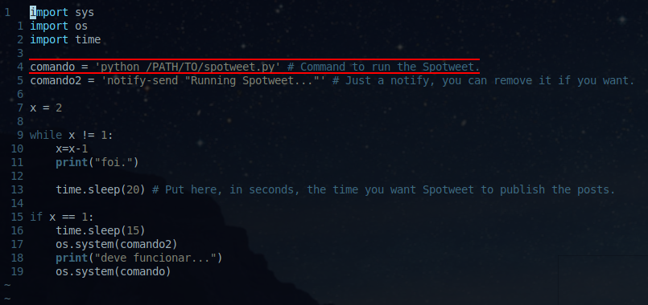
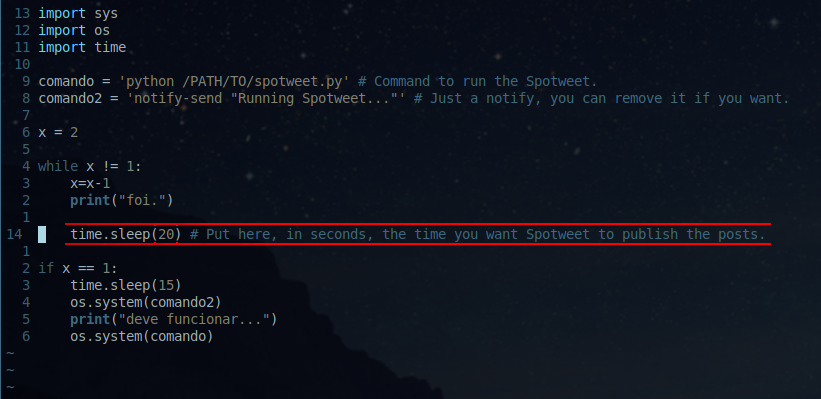
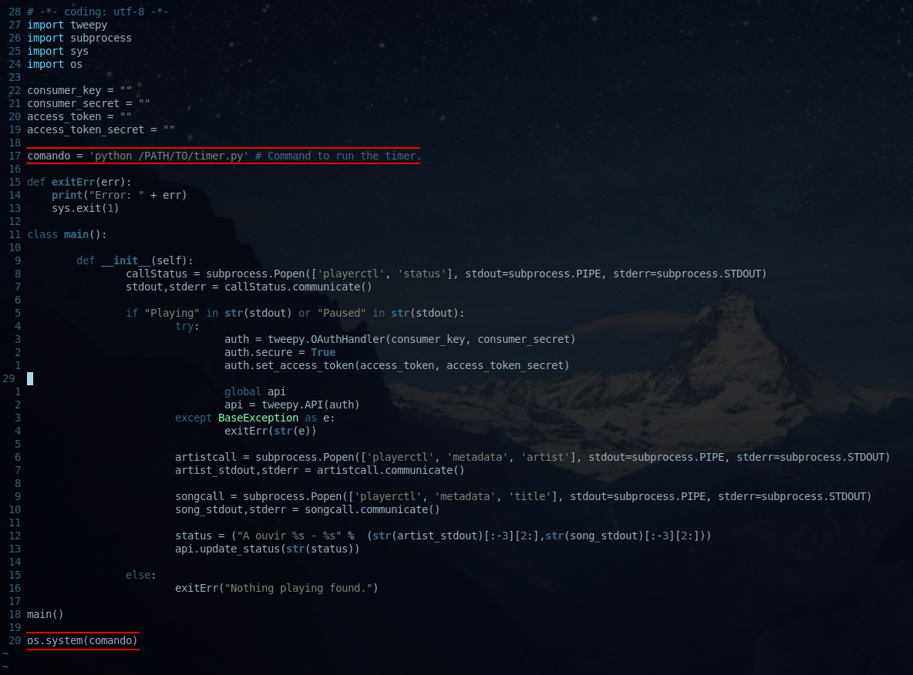

# Spotweet
Post on twitter the music you are listening to on spotify!

This is a script originally created by the user [Hiperbolt](https://github.com/hiperbolt), where I made some changes to include some instructions and also a timer.

# Requirements
**1 - Before actually using the script, you will need 4 items from Twitter:**
  - Consumer Key
  - Consumer Secret
  - Acess Token
  - Acess Token Secret

These things are some APIs that you will use to give permissions to the script so that it uses your account to make the posts. Insert these APIs in their places on spotweet.py

To find them, you will need to create a developer account on Twitter. The process is basically just filling in the spaces with the requested data [here](https://developer.twitter.com/en/apply-for-access).

**2 - Don't forget about PATHs!**

In both scripts you will need to point out the paths for each script. The process should be very simple, just replace these lines:
  - spotweet.py
  
  
  - timer.py
  
 
 **3 - Have [Tweepy](https://github.com/tweepy/tweepy) installed**

# Using It

Now that you've filled in the spaces with de APIs and PATHS, you can start making some changes to fit your taste.

**A recommendation of mine would be to change the timer:**        
You can either increase or decrease the timer time, or you can simply disable it.
      
To change the time, you will change the time.sleep() on line 14 in timer.py. Between the brackets, you will put in seconds the time you want the script to run.

If you just want to remove the timer and use the script manually, simply comment these two lines on spotweet.py:

# And that's it!
If everything went well, you should find in your account an image like this:

# Reported Errors:
  - if the script tries to post the same song as the previous post, the script gives an error;
  - Does NOT not support accented letters and asian symbols.
